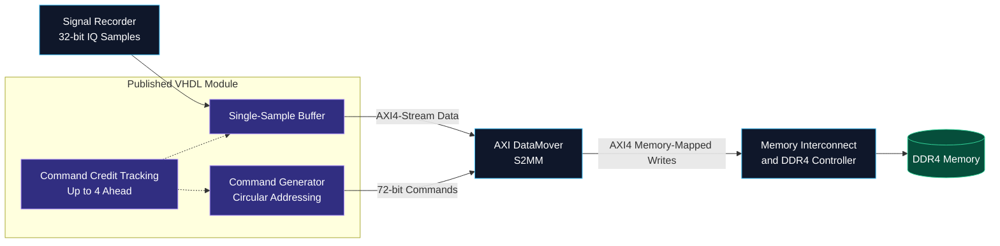

<div align="center">

# FPGA Stream-to-DDR4 Data Transfer

### AXI4-Stream → AXI4 Memory-Mapped → DDR4

**Custom VHDL command generation, IQ sample buffering, and queued transfers on the Xilinx ZCU216.**


[Overview](#overview) · [Architecture](#architecture) · [My Contribution](#my-contribution) · [Throughput Optimization](#throughput-optimization) · [Repository Scope](#repository-scope)

</div>

---

> **Research disclosure**  
> This work was carried out as part of a research project. Because of research-related disclosure restrictions, I can share only a small portion of the implementation publicly. This repository contains `datamover.vhd` as a representative example of my contribution; it does not include the complete research system.

## Overview

This project focused on moving streaming data into DDR4 memory on the **Xilinx Zynq UltraScale+ RFSoC ZCU216** platform. The data path uses the **AXI DataMover** to bridge incoming **AXI4-Stream** data to **AXI4 memory-mapped writes**, allowing the stream to be stored in external memory.

The central engineering task was connecting a streaming interface to an address-based memory system. AXI4-Stream carries data through a handshake-based interface, while memory-mapped transfers write data to specified addresses. The DataMover's **Stream-to-Memory-Mapped (S2MM)** path provides the transfer mechanism between these two domains.

| Area | Project focus |
| :--- | :--- |
| **Hardware platform** | Xilinx ZCU216 — Zynq UltraScale+ RFSoC |
| **Published source** | [`datamover.vhd`](./datamover.vhd) |
| **HDL** | VHDL |
| **Module input** | 32-bit IQ samples with availability and readiness signals |
| **DataMover-facing interfaces** | 72-bit AXI4-Stream commands and 32-bit AXI4-Stream data |
| **Transfer direction** | Stream-to-Memory-Mapped (S2MM) |
| **Memory-side interface** | AXI4 memory-mapped |
| **Storage destination** | DDR4 memory, with a 256 MiB circular address region |
| **Transfer size** | 4 bytes per command — one IQ sample |
| **Command look-ahead** | Up to four accepted commands awaiting data |
| **Public scope** | Selected source from a larger research implementation |

## Architecture

The diagram below shows the conceptual data path. It summarizes the role of the DataMover without exposing the complete research architecture or implying that every block is included in this repository.



The published entity, `datamover_s2mm_cmdgen`, implements the custom logic feeding the DataMover. The AMD/Xilinx DataMover IP and downstream DDR4 memory system are external to this module.

### How the transfer works

1. **Capture an IQ sample.** The module latches a 32-bit word, representing 16-bit I and 16-bit Q, when `iq_data_new` is asserted and its local buffer is empty.
2. **Prepare a destination.** A 72-bit command specifies a 4-byte incrementing transfer and a 32-bit destination address.
3. **Queue commands ahead of data.** Commands are counted only when the DataMover accepts them through the command `TVALID`/`TREADY` handshake.
4. **Send the buffered sample.** The data channel asserts `TVALID` when a sample is pending and at least one command credit is available. `TKEEP = 1111` marks all four bytes valid, and `TLAST = 1` marks each sample as a single-beat packet.
5. **Advance and wrap addresses.** Each accepted command reserves the next four-byte location. Address allocation wraps to the configured base after a 256 MiB region.

The DataMover converts these stream transfers into memory-mapped writes; the downstream memory controller handles physical DDR4 access. See the official [AXI DataMover overview](https://docs.amd.com/r/en-US/pg022_axi_datamover/Overview) and [command interface documentation](https://docs.amd.com/r/en-US/pg022_axi_datamover/Command-Interface).

## My Contribution

I developed VHDL logic to connect IQ samples from a signal recorder to the AXI DataMover's S2MM path, enabling stream-to-memory-mapped transfers into DDR4 on the ZCU216.

The work progressed from establishing the stream-to-DDR4 data path to exploring how command scheduling could reduce gaps between transfers. The shared implementation includes the command look-ahead logic used for that optimization.

My contribution includes:

- **Custom command generation:** Building 72-bit DataMover command packets with the transfer size, access type, and destination address.
- **IQ sample buffering and handshaking:** Holding a sample until the DataMover accepts it, and exposing readiness and data-acceptance signals to the surrounding design.
- **Configurable DDR addressing:** Using the `ddr_offset` input as the circular-buffer base, with four-byte address increments and wraparound across a 256 MiB region.
- **Command scheduling:** Tracking accepted commands and consumed data independently, with a look-ahead limit of four commands.
- **Debug instrumentation:** Marking command, data, buffer, credit, and address signals for observation with an Integrated Logic Analyzer (ILA).

## Throughput Optimization

### From basic transfers to command look-ahead

Establishing the S2MM path was the starting point. The next objective was to improve throughput by preparing commands ahead of the incoming data, reducing the need for a fresh command handshake to precede every sample immediately.

In the shared code, `MAX_QUEUED_COMMANDS = 4` sets the look-ahead limit. A credit counter coordinates the independently handshaken command and data channels:

| Event | Credit update | Address update |
| :--- | :--- | :--- |
| Command accepted | +1 | Advance by 4 bytes, wrapping at the region boundary |
| Data beat accepted | −1 | No change |
| Both accepted in the same cycle | No net change | Advance by 4 bytes, with wraparound |

This counter tracks **accepted commands whose corresponding data beats have not yet been accepted**. It is not a measurement of completed DDR4 writes or the exact occupancy of the DataMover's internal command FIFO.

The module can issue commands before an IQ sample arrives, then replenish command credits as samples are transferred. The intended benefit is to reduce command-related waiting and keep the transfer path supplied with work.

### Current implementation and further optimization

**Command look-ahead is implemented in this source; a measured throughput improvement is not reported in this repository.** Actual throughput depends on the source rate, buffering, DataMover configuration, and downstream memory behavior.

The published version uses one command per four-byte sample and a single-sample input buffer. Its active capture logic does not accept a replacement sample on the same clock edge that the previous sample is sent. This introduces a refill cycle even when the downstream interface is ready.

Further optimization opportunities include accepting a replacement sample during the outgoing handshake, adding an input FIFO to absorb bursts, and grouping multiple samples into larger transfers to reduce command overhead. These are possible extensions, not features claimed by the shared implementation.

<details>
<summary><strong>Implementation notes</strong></summary>

- `iq_ready` indicates that the local sample buffer is empty. The upstream source must respect this readiness; samples presented while the buffer is occupied are not captured.
- `iq_accepted` pulses when the DataMover accepts the outgoing data beat. It does not indicate completion of the DDR4 write.
- This module does not expose or process the DataMover S2MM status channel, so write-completion and error monitoring are outside the shared logic.
- `ddr_offset` initializes the current address on reset and is also used by the wraparound calculation. It should remain stable during a capture, and the configured region must fit within the system's mapped DDR address space.
- The declared `DEST_ADDR_BASE` generic is unused in the active addressing logic; the base comes from `ddr_offset`.
- ILA debug attributes are included in the source; measurement results and verification artifacts are not included here.

</details>

## Repository Scope

```text
.
├── README.md          # Project overview and architectural context
└── datamover.vhd      # Publicly shared VHDL source
```

This repository is a **portfolio excerpt**. The shared source provides a focused view of my work, while the surrounding research implementation remains outside the public repository.

The complete FPGA project, supporting IP configuration, system integration, and research-specific material are not provided here. Consequently, this repository alone is not a standalone design that can be built and deployed to the board.

## Technical References

- [AMD AXI DataMover Product Guide — PG022](https://docs.amd.com/r/en-US/pg022_axi_datamover/Overview)
- [AMD AXI DataMover Command Interface](https://docs.amd.com/r/en-US/pg022_axi_datamover/Command-Interface)
- [AMD ZCU216 Evaluation Board User Guide — UG1390](https://docs.amd.com/r/en-US/ug1390-zcu216-eval-bd/PS-DDR4-SODIMM-Socket)

---

<div align="center">

**VHDL · AXI4-Stream · AXI4 Memory-Mapped · DDR4 · RFSoC**

*A focused public example of FPGA development carried out within a larger research project.*

</div>
